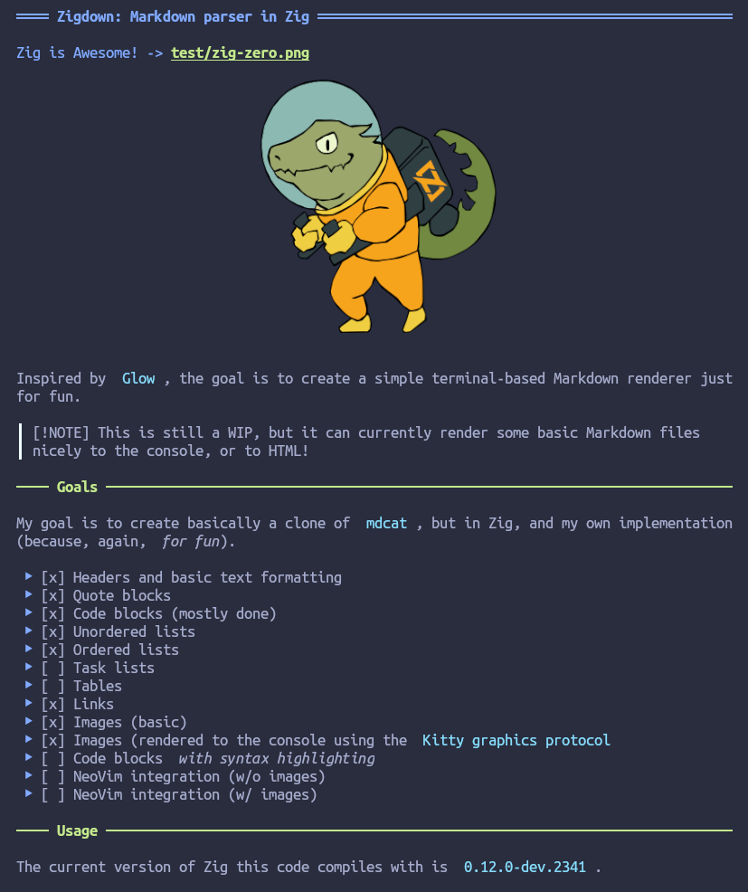

# Zigdown: Markdown parser in Zig


Inspired by [Glow](https://github.com/charmbracelet/glow), the goal is to create a simple
terminal-based Markdown renderer just for fun.

> \[!NOTE\] This is still a WIP, but it can currently render some basic Markdown files nicely to the
> console, or to HTML!

## Goals

My goal is to create basically a clone of [mdcat](https://github.com/swsnr/mdcat), but in Zig, and
my own implementation (because, again, _for fun_).

Note that I am **not** planning to implement complete CommonMark specification support, or even full
Markdown support by any definition. Rather, the goal is to support "nicely formatted" Markdown,
making some simplifying assumptions about what constitutes a paragraph vs. a code block, for
example. The "nicely formatted" caveat simplifies the parser somewhat, enabling easier extension for
new features like special warning and note boxes.

- [x] Headers and basic text formatting
- [x] Quote blocks
- [x] Code blocks (mostly done)
- [x] Unordered lists
- [x] Ordered lists
- [ ] Task lists
- [ ] Tables
- [x] Links
- [x] Images (basic)
- [x] Images (rendered to the console using the
  [Kitty graphics protocol](https://sw.kovidgoyal.net/kitty/graphics-protocol/)
- [x] Code blocks _with syntax highlighting_
- [ ] NeoVim integration (w/o images)
- [ ] NeoVim integration (w/ images)

## Usage

The current version of Zig this code compiles with is
[0.12.0-dev.2341](https://ziglang.org/builds/zig-linux-x86_64-0.12.0-dev.2341+92211135f.tar.xz).

```shell
zig build run -- -c test/sample.md
zig build -l # List build options
zig build -Dtarget=x86_64-linux-musl # Compile for x86-64 Linux using statically-linked MUSL libC
```

`zig build` will create a `zigdown` binary at `zig-out/bin/zigdown`. Add `-Doptimize=ReleaseSafe` to
enable optimizations while keeping safety checks and backtraces upon errors.

## Enabling Syntax Highlighting

To enable syntax highlighting within code blocks, you must install the necessary TreeSitter language
parsers and highlight queries for the languages you'd like to highlight. This can be done by
building and installing each language into a location in your `$LD_LIBRARY_PATH` environment
variable. For example:

```bash
#!/usr/bin/env bash

# Ensure the TS_CONFIG_DIR is available
export TS_CONFIG_DIR=$HOME/.config/tree-sitter/
mkdir -p ${TS_CONFIG_DIR}/parsers
cd ${TS_CONFIG_DIR}/parsers

# Clone and build a TreeSitter parser library
git clone https://github.com/tree-sitter/tree-sitter-cpp
cd tree-sitter-cpp
make install PREFIX=$HOME/.local/

# Add the install directory to LD_LIBRARY_PATH (if not done so already)
export LD_LIBRARY_PATH=$LD_LIBRARY_PATH:$HOME/.local/lib/
```

In addition to having the parser libraries available for `dlopen`, you will also need the highlight
queries. For this, use the provided bash script `./tools/fetch_queries.sh`. This will install the
queries to `$TS_CONFIG_DIR/queries`, which defaults to `$HOME/.config/tree-sitter/queries`.

**TODO:** Load a color scheme and a capture name -> color mapping at runtime (from file) instead of
a short hard-coded mapping.

## Status

Nearly complete! A few bugs remaining related to nested lists, plus some general cleanup required,
but the basics are largely implemented.

Once the basics are polished, the next steps will be to improve the rendering options, enable image
rendering, and work on advanced features like info boxes, task lists, tables, and more.


