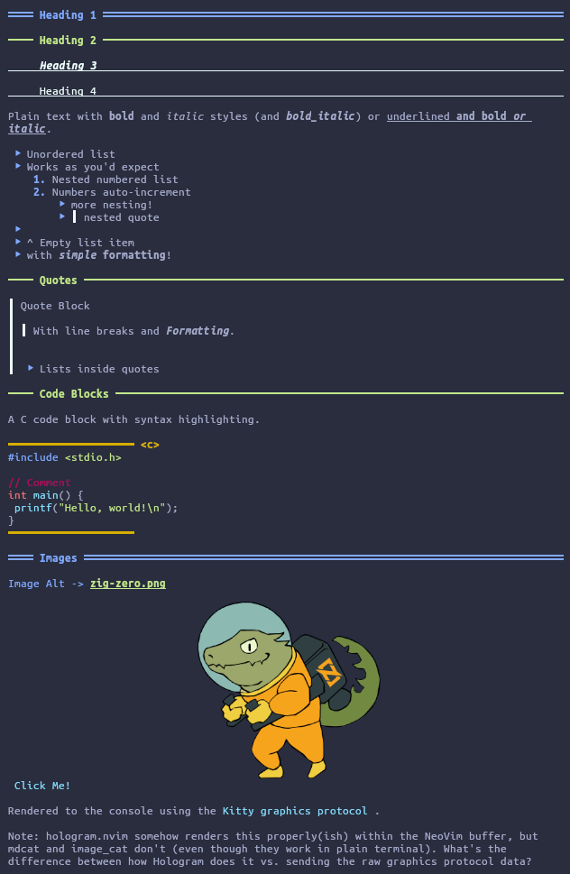
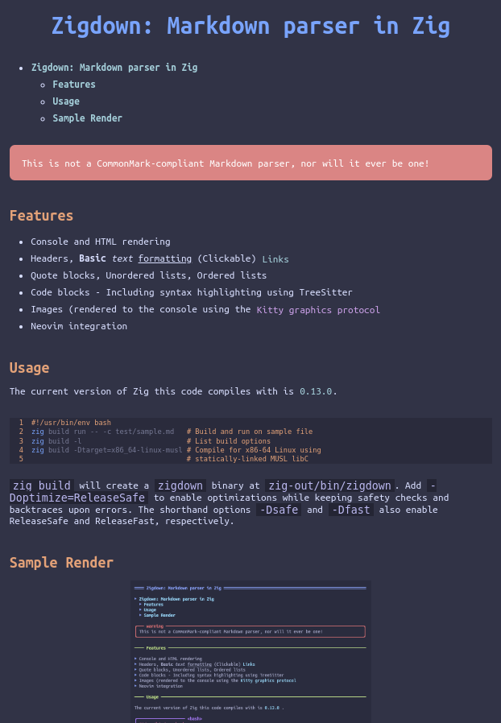

# Zigdown: Markdown toolset in Zig


```{toctree}
<This block will be rendered as a Table of Contents>
```


Zigdown, inspired by [Glow](https://github.com/charmbracelet/glow) and
[mdcat](https://github.com/swsnr/mdcat), is a tool to parse and render Markdown-like content to the
terminal or to HTML. It can also serve up a directory of files to your browser like a psuedo-static
web site, or present a set of files interactively as an in-terminal slide show.

This will likely forever be a WIP, but it currently supports the the most common features of simple
Markdown files.

```{warning}
This is not a CommonMark-compliant Markdown parser, nor will it ever be one!
```

## Tools

- **Console Renderer:** `zigdown console {file}`
- **HTML Renderer:** `zigdown html {file}`
- **Markdown Formatter:** `zigdown format {file}`
- **In-Terminal Slide Shows:** `zigdown present -d {directory}`
- **HTTP Document Server:** `zigdown serve -f {file}`

## Features & Future Work

### Parser Features

- [x] Headers
- [x] Basic text formatting (**Bold**, _italic_, ~strikethrough~)
- [x] Links
- [x] Quote blocks
- [x] Unordered lists
- [x] Ordered lists
- [x] Code blocks, including syntax highlighting using TreeSitter
- [x] Task lists
- [x] Tables
- [x] Autolinks
- [x] GitHub-Flavored Markdown Alerts

### Renderer Features

- [x] Console and HTML rendering
- [x] Images (rendered to the console using the
      [Kitty graphics protocol](https://sw.kovidgoyal.net/kitty/graphics-protocol/))
- [x] Web-based images (fetch from URL & display in-terminal)
- [x] (Clickable) Links
- [x] Tables
- [x] Automatic Table of Contents creation
- [x] Neovim integration (Lua)
- [x] Markdown formatter

### Future Work / Missing Pieces

- [ ] Enabling TreeSitter parsers to be used in WASM modules
      - Requires filling in some libC stub functions (the TS parsers use quite a few functions from
        the C standard library that are not available in WASM)
- [ ] Character escaping
- [ ] Deeper NeoVim integration: image rendering and auto-scrolling
- [ ] [Link References](https://spec.commonmark.org/0.31.2/#link-reference-definition)
- [ ] Color schemes for syntax highlighting

## Caveats

Note that I am **not** planning to implement complete CommonMark specification support, or even full
Markdown support by any definition. Rather, the goal is to support "nicely formatted" Markdown,
making some simplifying assumptions about what constitutes a paragraph vs. a code block, for
example. The "nicely formatted" caveat simplifies the parser somewhat, enabling easier extension for
new features like special warnings, note boxes, and other custom directives.

In addition to my "nicely formatted" caveat, I am also only interested in supporting a very common
subset of all Markdown syntax, and ignoring anything I personally find useless or annoying to parse.

### Things I Will Not Support

- Setext headings
- Thematic breaks
- Embedded HTML
- Indent-based code blocks (as opposed to fenced code blocks)

## Usage

The current version of Zig this code compiles with is
[0.14.0](https://ziglang.org/download/0.14.0/zig-linux-x86_64-0.14.0.tar.xz). I highly recommend
using the [Zig version manager](https://github.com/tristanisham/zvm) to install and manage various
Zig versions.

```bash
zig build run -- console test/sample.md
zig build -l # List build options
zig build -Dtarget=x86_64-linux-musl # Compile for x86-64 Linux using
                                     # statically-linked MUSL libC
```

`zig build` will create a `zigdown` binary at `zig-out/bin/zigdown`. Add `-Doptimize=ReleaseSafe` to
enable optimizations while keeping safety checks and backtraces upon errors. The shorthand options
`-Dsafe` and `-Dfast` also enable ReleaseSafe and ReleaseFast, respectively.

## Enabling Syntax Highlighting

To enable syntax highlighting within code blocks, you must install the necessary TreeSitter language
parsers and highlight queries for the languages you'd like to highlight. This can be done by
building and installing each language into a location in your `$LD_LIBRARY_PATH` environment
variable.

### Built-In Parsers

Zigdown comes with a number of TreeSitter parsers and highlight queries built-in:

- Bash
- C
- C++
- CMake
- JSON
- Make
- Python
- Rust
- YAML
- Zig

The parsers are downloaded from Github and the relevant source files are added to the build, and the
queries are stored at `data/queries/`, which contain some fixes and improvements to the original
highlighting queries.

### Installing Parsers Using Zigdown

The Zigdown cli tool can also download and install parsers for you. For example, to download, build,
and install the C and C++ parsers and their highlight queries:

```bash
zigdown install-parsers c,cpp # Assumes both exist at github.com/tree-sitter on the 'master' branch
zigdown install-parsers maxxnino:zig  # Specify the Github user; still assumes the 'master' branch
zigdown install-parsers tree-sitter:master:rust # Specify Github user, branch, and language
```

### Installing Parsers Manually

You can also install manually if Zigdown doesn't properly fetch the repo for you (or if the repo is
not setup in a standard manner and requires custom setup). For example, to install the C++ parser
from the default tree-sitter project on Github:

```bash
#!/usr/bin/env bash

# Ensure the TS_CONFIG_DIR is available
export TS_CONFIG_DIR=$HOME/.config/tree-sitter/
mkdir -p ${TS_CONFIG_DIR}/parsers
cd ${TS_CONFIG_DIR}/parsers

# Clone and build a TreeSitter parser library
git clone https://github.com/tree-sitter/tree-sitter-cpp
cd tree-sitter-cpp
make install PREFIX=$HOME/.local/

# Add the install directory to LD_LIBRARY_PATH (if not done so already)
export LD_LIBRARY_PATH=$LD_LIBRARY_PATH:$HOME/.local/lib/
```

In addition to having the parser libraries available for `dlopen`, you will also need the highlight
queries. For this, use the provided bash script `./tools/fetch_queries.sh`. This will install the
queries to `$TS_CONFIG_DIR/queries`, which defaults to `$HOME/.config/tree-sitter/queries`.

## Sample Renders

### Console



### HTML



### Presentations

[](https://asciinema.org/a/667398)
